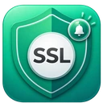
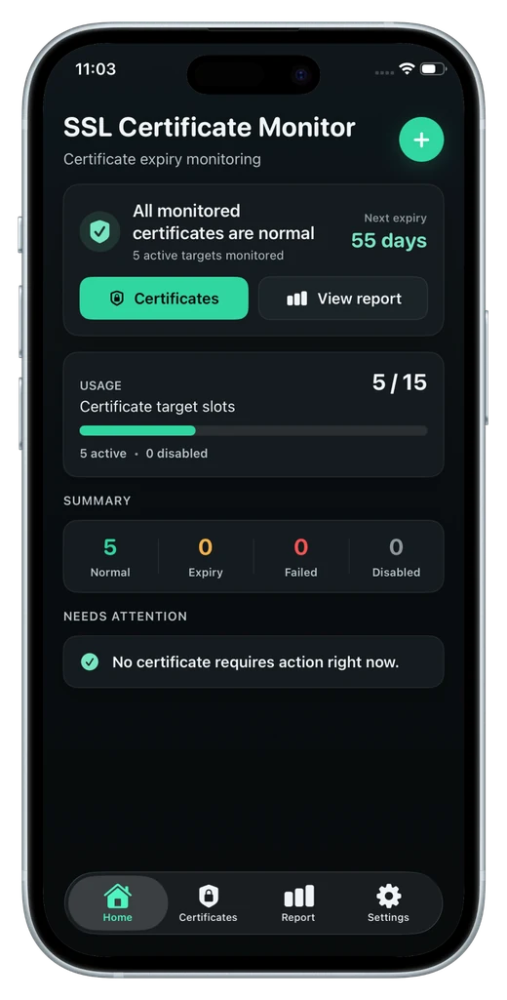

# SSL Certificate Monitor

**Know before your SSL certificate expires.**  
**在证书过期之前，先知道。**

Public SSL/TLS certificate monitoring for **iPhone and iPad** with daily cloud checks, Apple push alerts, certificate health signals, PDF reports, backup tools, and one-time capacity upgrades.

面向 **iPhone 与 iPad** 的公网 SSL/TLS 证书监控：每日云端检测、Apple 消息推送、Certificate Health、PDF 报告、备份还原，以及一次购买永久扩容。

 

 

[English](#english) · [简体中文](#简体中文) · [Privacy](https://ssl.opshome.run/privacy/) · [Support](https://ssl.opshome.run/support/)

 

---

## English

### Overview

**SSL Certificate Monitor** is a focused certificate-monitoring app for developers, webmasters, indie makers, homelab users, and small teams that want reliable SSL/TLS expiry visibility without deploying a full monitoring platform.

Add a public HTTPS target, optionally specify a custom reachable port, and let the cloud service check certificate status every day. The app can surface expiry risk and supported TLS health findings, send Apple push alerts, export certificate details as PDF, and back up or restore monitored targets.

### Key Features

| Capability | Description |
| --- | --- |
| **15 certificates free** | Monitor up to 15 public SSL/TLS certificate targets with no account required. |
| **Native iPhone & iPad layouts** | Optimized interfaces for both iPhone and iPad. |
| **Daily cloud checks** | Public certificate targets are checked every day so status and expiry information stay current. |
| **Apple push alerts** | Receive alerts when supported expiry risks or check failures are detected. |
| **Certificate Health** | Identify expiry risk, expired certificates, self-signed certificates, untrusted chains, hostname mismatch, and failed checks. |
| **Certificate details** | Review expiry date, days remaining, issuer, subject, hostname, port, and current status. |
| **Custom HTTPS ports** | Monitor public HTTPS services on port 443 or another publicly reachable HTTPS port. |
| **PDF reports** | Export certificate detail reports for review, documentation, or sharing. |
| **Backup, export & restore** | Export monitored targets and import them again when moving to a new device. |
| **Issuer grouping** | Organize larger certificate inventories by issuer and expiry state. |
| **No account required** | Start using the app without creating an OpsHome account. |
| **No ads** | Focused certificate monitoring without ad clutter. |
| **No subscription required** | Capacity upgrades are one-time, non-consumable in-app purchases. |

### How It Works

1. **Add a public HTTPS target**  
   Enter the hostname and, if required, a custom publicly reachable HTTPS port.

2. **Cloud checks run daily**  
   The service refreshes certificate status, expiry information, and supported health signals.

3. **Apple push alerts arrive**  
   When a supported expiry condition or check failure is detected, the service can notify your iPhone.

4. **Review, export, or back up**  
   Check certificate health, export PDF reports, and move monitored targets with import/export tools.

### Certificate Health

Certificate Health combines expiry information with practical TLS findings so the most important issues are easier to identify:

- Expiry risk and expired certificates
- Self-signed certificates
- Untrusted certificate chains
- Hostname or domain mismatch
- Failed certificate checks
- Priority issues that should be reviewed first

### Capacity Upgrades

SSL Certificate Monitor starts with **15 certificate slots free**. If you need more capacity, the app offers one-time, non-consumable upgrades:

| Plan | Capacity Added | Reference Price |
| --- | ---: | ---: |
| Free | 15 included | $0 |
| +50 | 50 additional slots | $3.99 |
| +100 | 100 additional slots | $8.99 |
| +500 | 500 additional slots | $19.99 |

Prices above are USD references. Actual App Store pricing may vary by country or region. Purchased capacity can be restored through the App Store.

### Privacy-First Design

Public certificate monitoring does **not** require server passwords, DNS credentials, or certificate private keys.

When cloud monitoring is enabled, the service may process only the information needed to provide certificate checks and notifications, including:

- Certificate targets you add, including host and port
- An anonymous device identifier
- Apple push notification token
- Certificate status summaries
- Temporary detailed check records

SSL Certificate Monitor does **not** collect:

- Server passwords
- Certificate private keys
- DNS credentials
- Website content
- Personal identity information for account registration

Detailed check records are retained for **48 hours**. After that, only the latest status summary and latest successful check summary are retained. Cloud data can be deleted from within the app.

Read the complete [Privacy Policy](https://ssl.opshome.run/privacy/).

### Monitoring Scope

Cloud monitoring is designed for **public SSL/TLS endpoints**. Private LAN, VPN-only, NAS, Proxmox, router, internal dashboards, and other non-public targets may not be reachable from the cloud checker.

SSL Certificate Monitor does not replace your certificate authority, reverse proxy, renewal automation, or a full infrastructure monitoring platform.

### Need Broader Infrastructure Monitoring?

For uptime monitoring, private networks, Docker Probe, Synology, Proxmox, VMware, Linux hosts, incidents, history, and Web Console access, use **OpsHome NOC**.

[Learn about OpsHome NOC](https://app.opshome.run/)

### App Store

[Download SSL Certificate Monitor on the App Store](https://apps.apple.com/us/app/ssl-reminder/id6786519365)

### Support

For product support, privacy questions, or troubleshooting:

- Visit the [SSL Certificate Monitor Support page](https://ssl.opshome.run/support/)
- Email [support@opshome.run](mailto:support@opshome.run)
- Include the app version, iOS/iPadOS version, and a short description of the issue
- Do not send private keys, passwords, or sensitive server credentials

---

## 简体中文

### 产品介绍

**SSL Certificate Monitor** 是一款专注公网 SSL/TLS 证书监控的 iPhone / iPad 应用，适合开发者、站长、独立开发者、Homelab 用户和小型团队。

添加公网 HTTPS 目标后，可按需指定自定义公网 HTTPS 端口，由云端每日更新证书状态。应用可展示到期风险与支持的 TLS 健康问题，通过 Apple 消息推送发送提醒，并支持 PDF 报告、目标导出、备份和还原。

### 核心功能

| 功能 | 说明 |
| --- | --- |
| **免费 15 个证书** | 无需创建账号即可监控最多 15 个公网 SSL/TLS 证书目标。 |
| **iPhone 与 iPad 原生布局** | 针对 iPhone 和 iPad 分别优化界面与信息展示。 |
| **每日云端检测** | 每日刷新证书状态与到期信息。 |
| **Apple 消息推送** | 检测到支持的到期风险或检查失败时发送提醒。 |
| **Certificate Health** | 识别到期风险、已过期、自签名、不受信任证书链、主机名不匹配和检测失败。 |
| **证书详情** | 查看到期日期、剩余天数、签发者、主题、主机名、端口和当前状态。 |
| **自定义 HTTPS 端口** | 除标准 443 外，也可监控公网可访问的其他 HTTPS 服务端口。 |
| **PDF 报告** | 导出证书详情 PDF，用于复核、留档或分享。 |
| **备份、导出与还原** | 导出监控目标，并可在更换设备后重新导入。 |
| **签发者分组** | 按签发者与到期状态整理较大的证书清单。 |
| **无需注册账号** | 无需创建 OpsHome 账号即可使用。 |
| **无广告** | 保持专注，不加入广告内容。 |
| **无需订阅** | 扩容采用一次性、非消耗型应用内购买。 |

### 工作方式

1. **添加公网 HTTPS 目标**  
   输入主机名；如有需要，可指定公网可访问的自定义 HTTPS 端口。

2. **云端每日检测**  
   服务更新证书状态、到期信息以及支持的健康信号。

3. **接收 Apple 消息推送**  
   检测到支持的到期条件或检查失败时，可向 iPhone 发送提醒。

4. **查看、导出或备份**  
   查看证书健康状态、导出 PDF 报告，并通过导入/导出工具迁移监控目标。

### Certificate Health

Certificate Health 将证书到期信息与实用 TLS 健康信号集中展示，帮助快速识别：

- 即将到期与已过期证书
- 自签名证书
- 不受信任的证书链
- 主机名或域名不匹配
- 证书检测失败
- 需要优先处理的问题

### 容量扩展

SSL Certificate Monitor 默认提供 **15 个免费证书槽位**。需要更大容量时，可通过一次性、非消耗型 IAP 永久增加槽位：

| 方案 | 增加容量 | 美元参考价 |
| --- | ---: | ---: |
| Free | 已包含 15 个 | $0 |
| +50 | 增加 50 个 | $3.99 |
| +100 | 增加 100 个 | $8.99 |
| +500 | 增加 500 个 | $19.99 |

以上为美元参考价格，实际 App Store 价格可能因国家或地区不同。已购买的扩容项目可通过 App Store 恢复购买。

### 隐私优先

公网证书监控**不需要**服务器密码、DNS 凭据或证书私钥。

启用云端监控后，服务可能处理：

- 用户添加的证书目标，包括主机和端口
- 匿名设备标识符
- Apple 消息推送通知令牌
- 证书状态摘要
- 临时详细检测记录

SSL Certificate Monitor **不会收集**：

- 服务器密码
- 证书私钥
- DNS 凭据
- 网站内容
- 用于账号注册的个人身份信息

详细检测记录保留 **48 小时**；之后仅保留最新状态摘要和最近一次成功检测摘要。用户可在 App 内删除云端数据。

查看完整的[隐私政策](https://ssl.opshome.run/zh-cn/privacy/)。

### 监控范围

云端检测面向**公网 SSL/TLS 服务**。局域网、仅 VPN 可访问、NAS、Proxmox、路由器、内部管理面板等非公开目标可能无法由云端检测服务访问。

SSL Certificate Monitor 不能替代证书颁发机构、反向代理配置、证书自动续期系统或完整的基础设施监控平台。

### 需要更完整的基础设施监控？

如果还需要可用性监控、内网、Docker Probe、Synology、Proxmox、VMware、Linux 主机、Incidents、历史数据和 Web Console，可使用 **OpsHome NOC**。

[了解 OpsHome NOC](https://app.opshome.run/)

### App Store

[在 App Store 下载 SSL Certificate Monitor](https://apps.apple.com/us/app/ssl-reminder/id6786519365)

### 支持

如需产品支持、隐私咨询或问题排查：

- 访问 [SSL Certificate Monitor 支持页面](https://ssl.opshome.run/zh-cn/support/)
- 邮件联系 [support@opshome.run](mailto:support@opshome.run)
- 请提供 App 版本、iOS/iPadOS 版本和简短的问题描述
- 请勿发送证书私钥、密码或敏感服务器凭据

---

**Free to start. Expand once. Keep certificate risk visible.**  
**免费开始，一次扩容，让证书风险持续可见。**

[Website](https://ssl.opshome.run) · [App Store](https://apps.apple.com/us/app/ssl-reminder/id6786519365) · [Privacy](https://ssl.opshome.run/privacy/) · [Support](https://ssl.opshome.run/support/)

 

© 2026 OpsHome™. All rights reserved.

